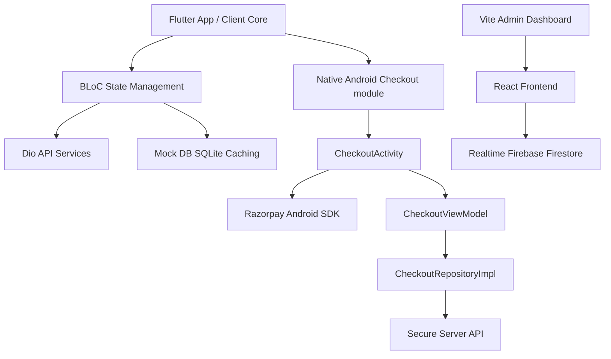

# Aura Premium Ecommerce Platform

[](#)
[](#)
[](#)
[](#)
[](#)

Aura is a state-of-the-art, minimal, and premium ecommerce ecosystem designed for luxury fashion, shoes, and accessories. Built with clean architecture, offline-first reliability, secure payment routing, and real-time operations, the platform consists of a Flutter mobile client, native Android Jetpack Compose checkout flows, and a React admin console.

---

## 📱 Architecture & Flow Overview

Aura is structured with modularity, security, and performance at its core:



### Technical Highlights
1. **Offline-First Room Caching**: High-priority user states (cart items, profiles, shipping parameters) are cached locally to provide zero-latency loading and offline session resilience.
2. **Secure Signature Verification Loop**: Payments initiated via the Razorpay SDK are verified securely on the backend using HMAC-SHA256 signatures, preventing clientside checkout spoofing.
3. **Asynchronous Webhook Fail-Safes**: Asynchronous Razorpay webhooks capture dropped network connections or client crashes during payment authorization, transitioning order statuses to `PLACED` even if the client app closes.
4. **StateFlow UI Bindings**: The native modules utilize Jetpack Compose listening to asynchronous Kotlin `StateFlow` structures, decoupling state modification from visual renderings.

---

## 🛠️ Tech Stack

* **Mobile App (Core)**: Flutter (Dart), BLoC State Management, GoRouter, GetIt (Service Locator), Dio (Networking).
* **Mobile App (Android Native)**: Kotlin, Jetpack Compose, Material3, Kotlin Coroutines & StateFlow, OkHttp.
* **Payment Processing**: Razorpay Android SDK & REST APIs.
* **Authentication & Backend**: Firebase Authentication (SMS OTP & Google Sign-In), Firestore Real-time Database.
* **Administrative Console**: React (JS), Vite, Tailwind CSS, Lucide Icons, Recharts (Analytics charts).
* **Documentation & Data**: Markdown, Mermaid diagrams, SQL/Room entities.

---

## 📂 Project Directory Structure

```
.
├── android_mvp/             # Native Android integration modules (Kotlin + Jetpack Compose)
│   ├── OrderStatus.kt       # Secure order state transitions
│   ├── CheckoutActivity.kt  # Razorpay SDK initializer & payment callbacks
│   ├── CheckoutRepository.kt# Network verification payload & signature notes
│   ├── CheckoutViewModel.kt # State management & timeline generator
│   └── CheckoutScreens.kt   # Jetpack Compose UI (timeline stepper, success/failure views)
│
├── lib/                     # Main Flutter mobile codebase
│   ├── core/                # Core theme, navigation routes, and shared widgets
│   └── features/            # Feature directories (Auth, Cart, Catalog, Orders, Wallet)
│
├── admin-dashboard/         # React admin console for managers
│   ├── src/                 # React source code (components, stats charts, Firebase config)
│   └── dist/                # Pre-built distribution files
│
├── preview/                 # Interactive HTML/CSS/JS mock mobile device shell
├── doc/                     # Project database schemas and blueprints
├── REQUIREMENTS.txt         # Environment configuration matrix and step-by-step setup guides
└── README.md                # System documentation (This file)
```

---

## 🚀 Setup & Execution Guide

### 1. Requirements & Prerequisites
- Flutter SDK `^3.0.0`
- Android Studio `Koala | 2024.1.1` or higher
- Android SDK API Level 34
- Node.js (v18+) & NPM
- Python 3 (For local mock servers)

### 2. Local Simulation Server Run (Immediate Preview)
If you want to view the interactive mobile client simulator shell side-by-side with the admin web panel:
```bash
# Start python HTTP server in workspace root
python3 -m http.server 8080
```
- Open **Interactive Emulator**: [http://localhost:8080/preview/index.html](http://localhost:8080/preview/index.html)
- Open **Admin Web Console**: [http://localhost:8080/admin-dashboard/dist/index.html](http://localhost:8080/admin-dashboard/dist/index.html)

### 3. Flutter Client Run
To deploy the full codebase directly to a live Android Emulator or physical device:
```bash
# Fetch pub packages
flutter pub get

# Launch on active emulator
flutter run
```

---

## 🔐 Security Features: Anti-Spoofing & Webhooks

When integrating Razorpay, a critical security risk involves users intercepting API requests and spoofing successful transactions without actual payments. Aura mitigates this:

1. **HMAC-SHA256 Signatures**: Razorpay returns a cryptographic signature on successful checkout:
   $$\text{Signature} = \text{HMAC-SHA256}(\text{order\_id} + "|" + \text{payment\_id}, \text{API\_SECRET})$$
   The backend replicates this calculation using the secret key (which is never stored in the APK file) and validates the client's signature before marking an order as `PLACED`.
2. **Server-to-Server Webhooks**: If the client's network drops post-payment, Razorpay sends a webhook directly to the backend. The backend processes the webhook, updates the database, and the client displays the updated tracking timeline next time they log in.

---

## 🎯 Future AI Roadmap

- [ ] **AI Search & Personalized Recommendations**: Implement a Vector Search database inside catalog listings for natural language queries (e.g. "comfy winter outfit for rain").
- [ ] **Dynamic Coupon Engine**: AI models monitoring purchase history to generate custom voucher discounts based on user conversion scores.
- [ ] **Predictive Stock Planning**: Real-time analytical predictions inside the Admin Dashboard calculating upcoming item demand based on seasonality and catalog search trends.
